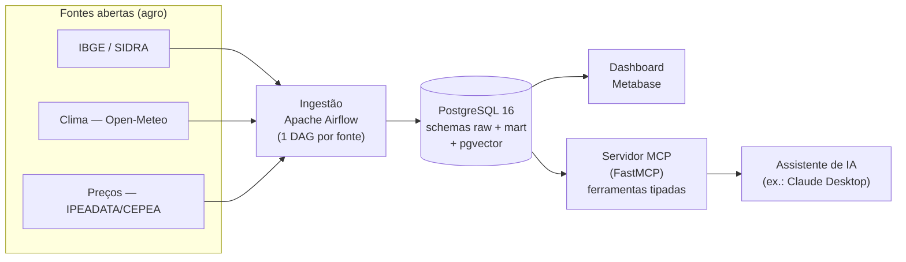

# AgroData — do dado aberto à decisão (com IA)

Plataforma **open source** que leva dados públicos do agronegócio brasileiro (produção, clima e
preços) da ingestão à decisão. Fontes abertas entram por **Apache Airflow**, são modeladas num
**PostgreSQL** (`raw` → `mart`, esquema dimensional, com `pgvector`), viram indicadores num
dashboard **Metabase** e ficam consultáveis em linguagem natural por qualquer assistente de IA
através de um **servidor MCP** que expõe os dados como ferramentas tipadas. É um **DW dimensional**
de porte pequeno: o que se prova é a arquitetura completa (ETL → modelagem → BI → IA/RAG), não o
volume. Projeto deliberadamente enxuto — toda ideia fora de escopo vive no [`IDEIAS.md`](IDEIAS.md),
nunca no código. Decisões e limitações ficam registradas em ADRs curtos em [`docs/adr/`](docs/adr/).



## Status

**Fase 0 — esqueleto.** Este repositório sobe a stack; as DAGs, o `mart`, o dashboard e o
servidor MCP entram nas fases seguintes. Roadmap e critérios de "pronto" resumidos no
[`CLAUDE.md`](CLAUDE.md); decisões de arquitetura em [`docs/adr/`](docs/adr/).

## Como rodar

Pré-requisitos: Docker + Docker Compose.

```bash
cp .env.example .env        # preencha POSTGRES_PASSWORD (segredos ficam só aqui — nunca no git)
docker compose up -d        # sobe postgres + airflow + metabase
```

Serviços:

| Serviço | URL | Observação |
|---|---|---|
| Airflow | http://localhost:8080 | usuário `admin`; senha gerada no 1º start (ver abaixo) |
| Metabase | http://localhost:3000 | assistente de setup na 1ª visita |
| PostgreSQL | `localhost:5432` | banco `agrodata` (DW), `airflow`, `metabase` |

A senha inicial do Airflow (modo `standalone`) é gerada automaticamente:

```bash
docker compose exec airflow cat /opt/airflow/standalone_admin_password.txt
```

Encerrar: `docker compose down` (dados persistem no volume `pgdata`) ou
`docker compose down -v` (apaga também os dados).

## Segurança (resumo — ver [ADR-001](docs/adr/ADR-001-gestao-de-segredos-e-baseline-de-container.md))

Segredos vivem só em `.env` local (no `.gitignore`); o repositório versiona apenas
`.env.example`. Imagens Docker com tag fixada (nunca `latest`). O Airflow roda com usuário não
root; Postgres e Metabase de-escalonam internamente e usam `no-new-privileges`. Todas as fontes
da V1 são **dados públicos abertos** — não há dado pessoal nem LGPD em escopo.

## Licença

A definir na Fase 4 (licença open source + citação obrigatória da fonte Open-Meteo).
