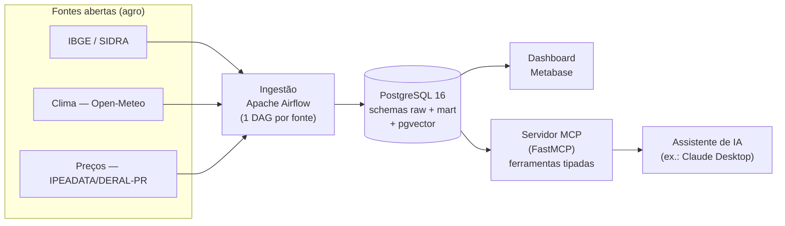

# AgroData — do dado aberto à decisão (com IA)

[](https://github.com/jonasrpacheco86/agrodata/actions/workflows/ci.yml)

Plataforma **open source** que leva dados públicos do agronegócio brasileiro (produção, clima e
preços) da ingestão à decisão. Fontes abertas entram por **Apache Airflow**, são modeladas num
**PostgreSQL** (`raw` → `mart`, esquema dimensional, com `pgvector`), viram indicadores num
dashboard **Metabase** e ficam consultáveis em linguagem natural por qualquer assistente de IA
através de um **servidor MCP** que expõe os dados como ferramentas tipadas. É um **DW dimensional**
de porte pequeno: o que se prova é a arquitetura completa (ETL → modelagem → BI → IA/RAG), não o
volume. Projeto deliberadamente enxuto — toda ideia fora de escopo vive no [`IDEIAS.md`](IDEIAS.md),
nunca no código. Decisões e limitações ficam registradas em ADRs curtos em [`docs/adr/`](docs/adr/).



## Status

**Fase 3 — a IA como interface (servidor MCP).** As três fontes já viram o `mart` com indicadores
(Fase 2). Agora um **servidor MCP** ([`mcp_server/`](mcp_server/README.md)) expõe o `mart` como
**ferramentas tipadas**: qualquer assistente de IA (ex.: Claude Desktop) consulta produção, clima,
preços e receita/ha em linguagem natural — a tese do "cérebro próprio". Segurança: conexão só-leitura
`mcp_ro`, sem text-to-SQL (ADR-004); o `pgvector` faz RAG só no dicionário de dados, não no dado
tabular (ADR-007). Roadmap resumido no [`CLAUDE.md`](CLAUDE.md); decisões em [`docs/adr/`](docs/adr/).

## Como rodar

Pré-requisitos: Docker + Docker Compose.

```bash
cp .env.example .env        # preencha as senhas (POSTGRES + os 3 papéis) — segredos só aqui, nunca no git
docker compose up -d        # sobe postgres + airflow + metabase
```

Serviços:

| Serviço | URL | Observação |
|---|---|---|
| Airflow | http://localhost:8080 | usuário `admin`; senha gerada no 1º start (ver abaixo) |
| Metabase | http://localhost:3000 | assistente de setup na 1ª visita |
| PostgreSQL | `localhost:5432` | banco `agrodata` (DW), `airflow`, `metabase` |

A senha inicial do Airflow (modo `standalone`) é gerada automaticamente:

```bash
docker compose exec airflow cat /opt/airflow/standalone_admin_password.txt
```

Encerrar: `docker compose down` (dados persistem no volume `pgdata`) ou
`docker compose down -v` (apaga também os dados).

> **Vindo da `v0.1.0`?** Os papéis de menor privilégio e os schemas (Fase 1) são criados pelos
> scripts em `db/init/`, que só rodam em **volume novo**. Rode `docker compose down -v && docker
> compose up -d` uma vez para aplicá-los (ainda não há dado real a perder).

## Fase 1: atualizar os dados (um clique)

1. No Airflow (localhost:8080), despause a DAG **`ibge_sidra_producao`** e clique em *Trigger*.
   Ela extrai o SIDRA para `raw.pam_sidra` e transforma no `mart` (idempotente — pode re-rodar).
2. Confira: `SELECT count(*) FROM mart.fato_producao;` (≈ municípios × culturas × anos).
3. Monte os gráficos seguindo [`docs/dashboard-fase1.md`](docs/dashboard-fase1.md) (data source com
   o papel `metabase_ro`).

## Fase 2: clima, preços e os 3 indicadores

Dispare também **`clima_openmeteo`** (5 municípios do noroeste do RS) e **`precos_ipeadata`**
(soja/milho/trigo). Elas populam `mart.fato_clima_safra` e `mart.fato_preco_mensal`, e as views
`vw_chuva_rendimento`, `vw_receita_hectare` e `vw_preco_sazonal` entregam os indicadores. Monte o
dashboard por [`docs/dashboard-fase2.md`](docs/dashboard-fase2.md).

## Fase 3: consultar por IA (servidor MCP)

O [`mcp_server/`](mcp_server/README.md) expõe 5 ferramentas tipadas (`producao`, `chuva_no_ciclo`,
`preco`, `receita_por_hectare`, `busca_metadados`) sobre o `mart`, como só-leitura (`mcp_ro`).
Conecte no Claude Desktop e pergunte em linguagem natural — instruções e `claude_desktop_config.json`
no [README do servidor](mcp_server/README.md).

## Segurança (resumo — ver [`docs/adr/`](docs/adr/))

Segredos vivem só em `.env` local (no `.gitignore`); o repositório versiona apenas `.env.example`.
Imagens Docker com tag fixada (nunca `latest`); Airflow non-root, `no-new-privileges` em todos
([ADR-001](docs/adr/ADR-001-gestao-de-segredos-e-baseline-de-container.md)). No banco, **menor
privilégio**: `airflow_rw` escreve `raw`+`mart`, `metabase_ro` lê só `mart`, `mcp_ro` lê só as
views — nenhum serviço usa o superusuário no DW
([ADR-002](docs/adr/ADR-002-menor-privilegio-no-banco.md)). Todas as fontes da V1 são **dados
públicos abertos** — não há dado pessoal nem LGPD em escopo.

## Fontes de dados

- **Produção**: IBGE / SIDRA — Produção Agrícola Municipal (tabela 5457), API pública.
- **Clima**: dados meteorológicos por [Open-Meteo](https://open-meteo.com/) (Open-Meteo Historical
  Weather API), licenciados sob **CC BY 4.0** — citação obrigatória pela licença.
- **Preços**: IPEADATA, séries DERAL-PR "preço recebido pelo agricultor" (proxy regional do Paraná;
  ver [ADR-006](docs/adr/ADR-006-precos-deral-pr-proxy.md)).

## Licença

Código sob [Apache License 2.0](LICENSE). Dados sob as licenças das respectivas fontes (ver acima).
