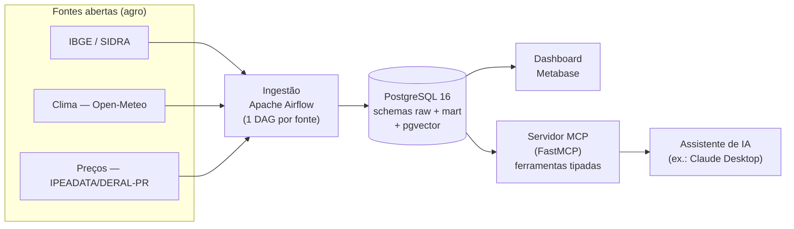

# AgroData — do dado aberto à decisão (com IA)

[](https://github.com/jonasrpacheco86/agrodata/actions/workflows/ci.yml)

Plataforma **open source** que leva dados públicos do agronegócio brasileiro (produção, clima e
preços) da ingestão à decisão. Fontes abertas entram por **Apache Airflow**, são modeladas num
**PostgreSQL** (`raw` → `mart`, esquema dimensional, com `pgvector`), viram indicadores num
dashboard **Metabase** e ficam consultáveis em linguagem natural por qualquer assistente de IA
através de um **servidor MCP** que expõe os dados como ferramentas tipadas. É um **DW dimensional**
de porte pequeno: o que se prova é a arquitetura completa (ETL → modelagem → BI → IA/RAG), não o
volume. Projeto deliberadamente enxuto — toda ideia fora de escopo vive no [`IDEIAS.md`](IDEIAS.md),
nunca no código. Decisões e limitações ficam registradas em ADRs curtos em [`docs/adr/`](docs/adr/).



## Status — V1 completa

Fluxo completo entregue e publicado (`v1.0.0`):

| Fase | Entrega | Tag |
|---|---|---|
| 0 | Esqueleto (Compose: Postgres+pgvector / Airflow / Metabase) | `v0.1.0` |
| 1 | Produção (IBGE/SIDRA) ponta a ponta → `mart` + dashboard | `v0.2.0` |
| 2 | Clima (Open-Meteo) + preços (IPEADATA) + 3 indicadores + CI | `v0.3.0` |
| 3 | Servidor MCP (5 ferramentas tipadas) + RAG nos metadados | `v0.4.0` |
| 4 | Documentação, modelo de ameaças e publicação | `v1.0.0` |
| 5 (opcional) | Deploy público do MCP (Neon + Render), endurecido (SecDevOps + FinOps) | `v1.1.0` |

Verificado end-to-end: **497 municípios × 4 culturas × 11 anos = 21.868 fatos** de produção; a seca
2021/22 aparece nos dados (rendimento da soja em Cruz Alta cai a 1.337 kg/ha); as 5 ferramentas MCP
respondem com os dados corretos do `mart`. Roadmap no [`CLAUDE.md`](CLAUDE.md); decisões em
[`docs/adr/`](docs/adr/).

## Como rodar

Pré-requisitos: Docker + Docker Compose.

```bash
cp .env.example .env        # preencha as senhas (POSTGRES + os 3 papéis) — segredos só aqui, nunca no git
docker compose up -d        # sobe postgres + airflow + metabase
```

Serviços:

| Serviço | URL | Observação |
|---|---|---|
| Airflow | http://localhost:8080 | usuário `admin`; senha gerada no 1º start (ver abaixo) |
| Metabase | http://localhost:3000 | assistente de setup na 1ª visita |
| PostgreSQL | `localhost:5432` | banco `agrodata` (DW), `airflow`, `metabase` |

A senha inicial do Airflow (modo `standalone`) é gerada automaticamente:

```bash
docker compose exec airflow cat /opt/airflow/standalone_admin_password.txt
```

Encerrar: `docker compose down` (dados persistem no volume `pgdata`) ou
`docker compose down -v` (apaga também os dados).

> **Vindo da `v0.1.0`?** Os papéis de menor privilégio e os schemas (Fase 1) são criados pelos
> scripts em `db/init/`, que só rodam em **volume novo**. Rode `docker compose down -v && docker
> compose up -d` uma vez para aplicá-los (ainda não há dado real a perder).

## Fase 1: atualizar os dados (um clique)

1. No Airflow (localhost:8080), despause a DAG **`ibge_sidra_producao`** e clique em *Trigger*.
   Ela extrai o SIDRA para `raw.pam_sidra` e transforma no `mart` (idempotente — pode re-rodar).
2. Confira: `SELECT count(*) FROM mart.fato_producao;` (≈ municípios × culturas × anos).
3. Monte os gráficos seguindo [`docs/dashboard-fase1.md`](docs/dashboard-fase1.md) (data source com
   o papel `metabase_ro`).

## Fase 2: clima, preços e os 3 indicadores

Dispare também **`clima_openmeteo`** (5 municípios do noroeste do RS) e **`precos_ipeadata`**
(soja/milho/trigo). Elas populam `mart.fato_clima_safra` e `mart.fato_preco_mensal`, e as views
`vw_chuva_rendimento`, `vw_receita_hectare` e `vw_preco_sazonal` entregam os indicadores. Monte o
dashboard por [`docs/dashboard-fase2.md`](docs/dashboard-fase2.md).

## Fase 3: consultar por IA (servidor MCP)

O [`mcp_server/`](mcp_server/README.md) expõe 5 ferramentas tipadas (`producao`, `chuva_no_ciclo`,
`preco`, `receita_por_hectare`, `busca_metadados`) sobre o `mart`, como só-leitura (`mcp_ro`).
Conecte no Claude Desktop e pergunte em linguagem natural — instruções e `claude_desktop_config.json`
no [README do servidor](mcp_server/README.md).

## Demonstração

Pergunta do produtor à IA: *"Qual o rendimento da soja em Passo Fundo em 2022?"* — a IA chama a
ferramenta e responde com o dado da plataforma:

```jsonc
// tool: producao(municipio="Passo Fundo", cultura="soja", ano=2022)
[{ "ano": 2022, "municipio": "Passo Fundo", "cultura": "Soja (em grão)",
   "area_colhida_ha": 41000, "quantidade_produzida_t": 86100, "rendimento_medio_kg_ha": 2100 }]

// tool: busca_metadados("quanto choveu na safra e como ficou o rendimento")
// → aponta a ferramenta certa (RAG só nos metadados, ADR-007):
[{ "objeto": "vw_chuva_rendimento", "score": 0.513 },
 { "objeto": "chuva_no_ciclo / vw_clima_safra", "score": 0.473 }]
```

Prints do dashboard (Metabase) e da interação em [`docs/screenshots/`](docs/screenshots/).

## Segurança

Pilar preventivo aplicado e documentado (mapeado ao NIST CSF), não só instalado:
- **Segredos** só em `.env` local; `.gitignore` + gitleaks no CI ([ADR-001](docs/adr/ADR-001-gestao-de-segredos-e-baseline-de-container.md)).
- **Menor privilégio no banco**: `airflow_rw`/`metabase_ro`/`mcp_ro`, nenhum superusuário no DW ([ADR-002](docs/adr/ADR-002-menor-privilegio-no-banco.md)).
- **CI/cadeia de suprimentos**: gitleaks + ruff + pip-audit — pegou um CVE real no `requests` e foi corrigido em imagem derivada ([ADR-003](docs/adr/ADR-003-ci-supply-chain.md)). Somam-se os testes da borda pública (`mcp_server/test_borda.py`: tetos de taxa e comparação do bearer) e o build/scan da imagem.
- **Superfície da IA**: MCP só-leitura, ferramentas tipadas, sem text-to-SQL ([ADR-004](docs/adr/ADR-004-superficie-mcp.md)).
- **Modelo de ameaças** e o que fica **fora de escopo** (sem PII/LGPD — fontes são dados públicos) em [ADR-005](docs/adr/ADR-005-escopo-seguranca-ameacas.md).
- **Deploy**: promoção manual, container non-root provado no CI, actions pinadas por SHA, limite de taxa e `statement_timeout` na borda ([ADR-009](docs/adr/ADR-009-secdevops-do-deploy.md)) — e **FinOps** como restrição de arquitetura, não como economia ([ADR-010](docs/adr/ADR-010-finops-free-tier.md)). Os dois pilares detalhados, com o que ficou deliberadamente de fora, em [`docs/secdevops-finops.md`](docs/secdevops-finops.md).

## Decisões (ADRs)

| # | Decisão |
|---|---|
| [001](docs/adr/ADR-001-gestao-de-segredos-e-baseline-de-container.md) | Gestão de segredos e baseline de container |
| [002](docs/adr/ADR-002-menor-privilegio-no-banco.md) | Separação de papéis e menor privilégio no banco |
| [003](docs/adr/ADR-003-ci-supply-chain.md) | Cadeia de suprimentos e verificação automatizada no CI |
| [004](docs/adr/ADR-004-superficie-mcp.md) | Superfície do MCP e por que não text-to-SQL livre |
| [005](docs/adr/ADR-005-escopo-seguranca-ameacas.md) | Escopo de segurança e modelo de ameaças |
| [006](docs/adr/ADR-006-precos-deral-pr-proxy.md) | Preços DERAL-PR como proxy regional |
| [007](docs/adr/ADR-007-rag-onde-serve.md) | RAG onde serve, determinismo onde a precisão manda |
| [008](docs/adr/ADR-008-exposicao-publica.md) | Exposição pública do demo (só MCP, autenticado) |
| [009](docs/adr/ADR-009-secdevops-do-deploy.md) | SecDevOps do deploy: cadeia de entrega e baseline do runtime publicado |
| [010](docs/adr/ADR-010-finops-free-tier.md) | FinOps: o free tier como restrição de arquitetura |

## Fontes de dados

- **Produção**: IBGE / SIDRA — Produção Agrícola Municipal (tabela 5457), API pública.
- **Clima**: dados meteorológicos por [Open-Meteo](https://open-meteo.com/) (Open-Meteo Historical
  Weather API), licenciados sob **CC BY 4.0** — citação obrigatória pela licença.
- **Preços**: IPEADATA, séries DERAL-PR "preço recebido pelo agricultor" (proxy regional do Paraná;
  ver [ADR-006](docs/adr/ADR-006-precos-deral-pr-proxy.md)).

## Licença

Código sob [Apache License 2.0](LICENSE). Dados sob as licenças das respectivas fontes (ver acima).
