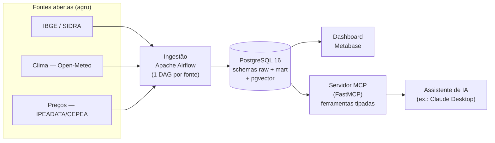

# AgroData — do dado aberto à decisão (com IA)

Plataforma **open source** que leva dados públicos do agronegócio brasileiro (produção, clima e
preços) da ingestão à decisão. Fontes abertas entram por **Apache Airflow**, são modeladas num
**PostgreSQL** (`raw` → `mart`, esquema dimensional, com `pgvector`), viram indicadores num
dashboard **Metabase** e ficam consultáveis em linguagem natural por qualquer assistente de IA
através de um **servidor MCP** que expõe os dados como ferramentas tipadas. É um **DW dimensional**
de porte pequeno: o que se prova é a arquitetura completa (ETL → modelagem → BI → IA/RAG), não o
volume. Projeto deliberadamente enxuto — toda ideia fora de escopo vive no [`IDEIAS.md`](IDEIAS.md),
nunca no código. Decisões e limitações ficam registradas em ADRs curtos em [`docs/adr/`](docs/adr/).



## Status

**Fase 1 — uma fonte de ponta a ponta.** Uma DAG do Airflow extrai a Produção Agrícola Municipal
do IBGE/SIDRA (RS, soja/milho/trigo/arroz, ~10 anos) → `raw` → `mart` dimensional, e o Metabase
mostra os indicadores. O dashboard, o cruzamento com clima/preços e o servidor MCP entram nas
fases seguintes. Roadmap resumido no [`CLAUDE.md`](CLAUDE.md); decisões em [`docs/adr/`](docs/adr/).

## Como rodar

Pré-requisitos: Docker + Docker Compose.

```bash
cp .env.example .env        # preencha as senhas (POSTGRES + os 3 papéis) — segredos só aqui, nunca no git
docker compose up -d        # sobe postgres + airflow + metabase
```

Serviços:

| Serviço | URL | Observação |
|---|---|---|
| Airflow | http://localhost:8080 | usuário `admin`; senha gerada no 1º start (ver abaixo) |
| Metabase | http://localhost:3000 | assistente de setup na 1ª visita |
| PostgreSQL | `localhost:5432` | banco `agrodata` (DW), `airflow`, `metabase` |

A senha inicial do Airflow (modo `standalone`) é gerada automaticamente:

```bash
docker compose exec airflow cat /opt/airflow/standalone_admin_password.txt
```

Encerrar: `docker compose down` (dados persistem no volume `pgdata`) ou
`docker compose down -v` (apaga também os dados).

> **Vindo da `v0.1.0`?** Os papéis de menor privilégio e os schemas (Fase 1) são criados pelos
> scripts em `db/init/`, que só rodam em **volume novo**. Rode `docker compose down -v && docker
> compose up -d` uma vez para aplicá-los (ainda não há dado real a perder).

## Fase 1: atualizar os dados (um clique)

1. No Airflow (localhost:8080), despause a DAG **`ibge_sidra_producao`** e clique em *Trigger*.
   Ela extrai o SIDRA para `raw.pam_sidra` e transforma no `mart` (idempotente — pode re-rodar).
2. Confira: `SELECT count(*) FROM mart.fato_producao;` (≈ municípios × culturas × anos).
3. Monte os gráficos seguindo [`docs/dashboard-fase1.md`](docs/dashboard-fase1.md) (data source com
   o papel `metabase_ro`).

## Segurança (resumo — ver [`docs/adr/`](docs/adr/))

Segredos vivem só em `.env` local (no `.gitignore`); o repositório versiona apenas `.env.example`.
Imagens Docker com tag fixada (nunca `latest`); Airflow non-root, `no-new-privileges` em todos
([ADR-001](docs/adr/ADR-001-gestao-de-segredos-e-baseline-de-container.md)). No banco, **menor
privilégio**: `airflow_rw` escreve `raw`+`mart`, `metabase_ro` lê só `mart`, `mcp_ro` lê só as
views — nenhum serviço usa o superusuário no DW
([ADR-002](docs/adr/ADR-002-menor-privilegio-no-banco.md)). Todas as fontes da V1 são **dados
públicos abertos** — não há dado pessoal nem LGPD em escopo.

## Licença

[Apache License 2.0](LICENSE). A citação da fonte **Open-Meteo** é obrigatória (exigência da
licença dos dados) e será incluída no README ao integrar essa fonte na Fase 2.
